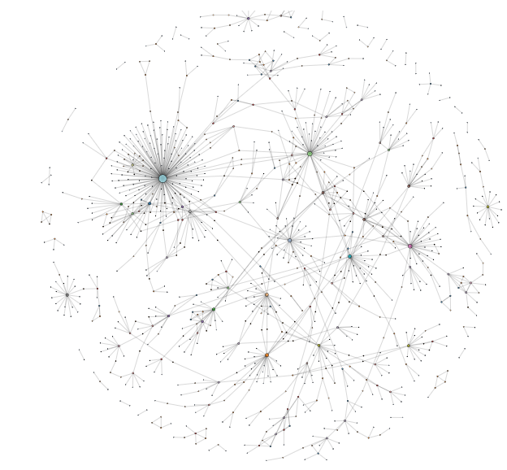
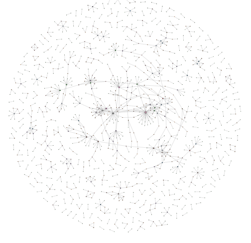
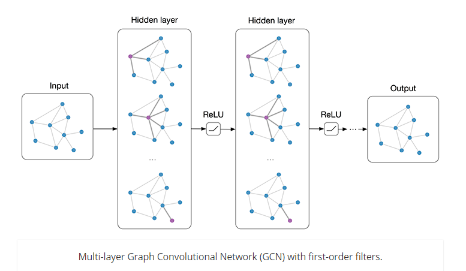
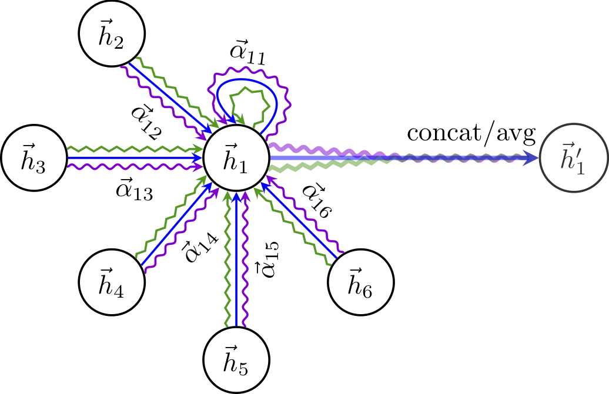

#GNN(Graph Neural Network)
 Provide Example of Graph Neural Networks

---

###index
- Benchmark Dataset
- GCN(Graph Convolutional Network)
- GAT(Graph Attention Network)

---
##Benchmark Dataset
###[Cora](https://relational.fit.cvut.cz/dataset/CORA)
  
sota : https://paperswithcode.com/sota/node-classification-on-cora

###[Citeseer](https://linqs.soe.ucsc.edu/data)
  
sota : https://paperswithcode.com/sota/node-classification-on-citeseer

###[Pubmed](https://www.nlm.nih.gov/databases/download/pubmed_medline.html)  
sota : https://paperswithcode.com/sota/node-classification-on-pubmed

----

##GCN (Grapth Convolutional Networks)
https://arxiv.org/abs/1609.02907

###Overview

---

###

##GAT (Graph Attention Network)
https://openreview.net/forum?id=rJXMpikCZ

###Overview

---

###Train

~~~
usage : 
$ python train.py --epochs 1000

mode:
- gat
- spgat
- gcn

dataset :
- cora
- citeseer
- pubmed (not tested)

parameters:

--model default='gat', help='select model'
--data default='cora', help='select dataset'
--epochs default=100000, help='Number of epochs to train.'
--niter default=10, help='iter value for avg.'
--early_stopping default=False, help='set early_stopping'
--lr default=0.005, help='Initial learning rate.'
--seed default=72, help='Random seed.'
--weight_decay default=5e-4, help='Weight decay (L2 loss on parameters).'
--hidden default=8, help='Number of hidden units.'
--nb_heads default=8, help='Number of head attentions.'
--dropout default=0.6, help='Dropout rate (1 - keep probability).'
--alpha default=0.2, help='Alpha for the leaky_relu.'
--patience default=100, help='Patience'
--verbose default=False, help='set early_stopping'

parameters usage:
$ python train.py --epochs 1000 --data citeseer --verbose --seed 80

~~~

###Result

|          | GCN   | GAT    | SPGAT |
|----------|-------|--------|-------------------------|
| Cora     | 0.816 | 0.814  | 0.812                   |
| Citeseer | 0.702 | 0.7039 | 0.7083                  |

Speed: GCN > SPGAT > GAT

###Reference

    @article{
      velickovic2018graph,
      title="{Graph Attention Networks}",
      author={Veli{\v{c}}kovi{\'{c}}, Petar and Cucurull, Guillem and Casanova, Arantxa and Romero, Adriana and Li{\`{o}}, Pietro and Bengio, Yoshua},
      journal={International Conference on Learning Representations},
      year={2018},
      url={https://openreview.net/forum?id=rJXMpikCZ},
      note={accepted as poster},
    }
    @article{kipf2016semi,
      title={Semi-Supervised Classification with Graph Convolutional Networks},
      author={Kipf, Thomas N and Welling, Max},
      journal={arXiv preprint arXiv:1609.02907},
      year={2016}
    }
    @inproceedings{nr,
         title={The Network Data Repository with Interactive Graph Analytics and Visualization},
         author={Ryan A. Rossi and Nesreen K. Ahmed},
         booktitle={AAAI},
         url={http://networkrepository.com},
         year={2015}
    }
####GCN
[Tensorflow] https://github.com/tkipf/gcn  
[Pytorch] https://github.com/tkipf/pygcn  
[Pytorch] https://github.com/marblet/gcnns  

####GAT
[Tensorflow] https://github.com/PetarV-/GAT  
[Keras] https://github.com/danielegrattarola/keras-gat  
[Pytorch] https://github.com/marblet/gat-pytorch   
[Pytorch] https://github.com/Diego999/pyGAT

